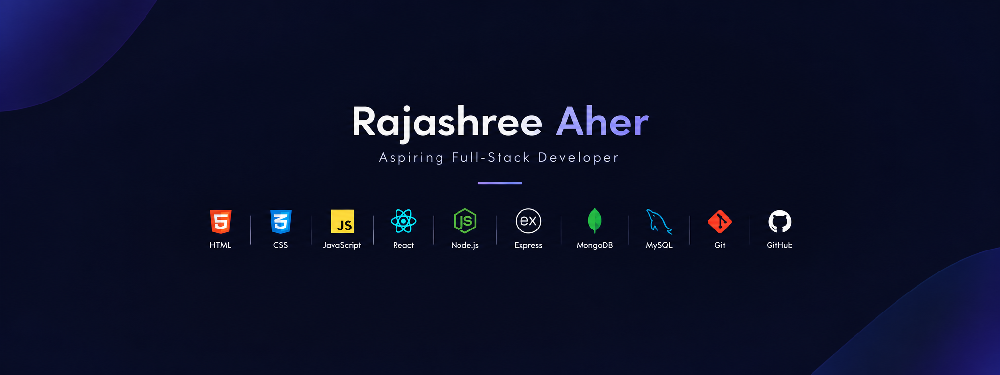

  

---
# 👋 Hey there, I'm Rajashree Aher!

### 💻 Aspiring Full-Stack Developer | MERN Stack | Problem Solver

Building projects, learning new technologies, and turning ideas into reality. 🚀

---

## 🌟 About Me

🎓 Third-year B.Tech Information Technology student at AISSMS IOIT.

💻 Aspiring Full-Stack Developer passionate about building interactive and user-friendly web applications.

🌱 Currently strengthening my skills in **MERN Stack Development, Data Structures & Algorithms, and Cloud Technologies**.

🛠️ I enjoy building real-world projects, exploring new tools, and continuously improving my problem-solving skills.

🎯 My goal is to become a skilled software developer and contribute to impactful projects.

---

## 🧰 Tech Stack

### 🌐 Frontend

### ⚙️ Backend & Database

### 💻 Programming Languages

### 🛠️ Tools & Technologies

---

## 🚀 Featured Project

### 🏡 Wanderlust — Travel & Accommodation Platform

A full-stack web application inspired by Airbnb, built to explore and manage travel accommodation listings.

* 🔐 User authentication and authorization
* 🏠 Create, view, update, and delete accommodation listings
* 🖼️ Image uploads and cloud image storage
* ⭐ Reviews and ratings
* 🗺️ Location and map integration
* 🔎 Search and filtering functionality
* 🛠️ Built using Node.js, Express.js, MongoDB, EJS, and related web technologies

**Tech Stack:** JavaScript • Node.js • Express.js • MongoDB • EJS • Cloudinary

🔗 [Explore my repositories](https://github.com/rajashreeaher01?tab=repositories)

---

## 📚 Currently Working On

* 📌 Practicing Data Structures & Algorithms
* ⚛️ Strengthening React and full-stack development
* ☁️ Exploring cloud computing and DevOps
* 🤖 Learning about Machine Learning and AI
* 🚀 Building projects to improve my development skills

---

## 📊 GitHub Statistics

  

  

---

## 🤝 Let's Connect!

I'm always interested in connecting with fellow developers, collaborating on projects, and exploring opportunities to learn and grow.

📧 **Email:** [rajashreeaher.work@gmail.com](mailto:rajashreeaher.work@gmail.com)

💼 **LinkedIn:** [Connect with me](https://www.linkedin.com/in/rajashree-aher/)

🐙 **GitHub:** [@rajashreeaher01](https://github.com/rajashreeaher01)

---

  <i>"Learning by building. Growing by solving. Creating with purpose."</i> ✨

